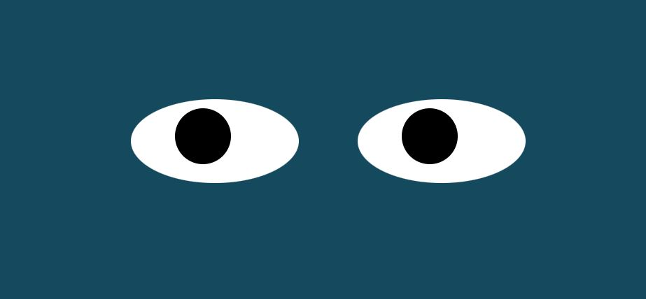

  

  
  

  

<h1>Eye Movement</h1>

<h2>The Assignment:</h2>

This weeks assignment was to create a set of eyes on screen using independent shapes with individual movement restrictions. 

The "pupils" also follow the cursor around the screen accurately.

